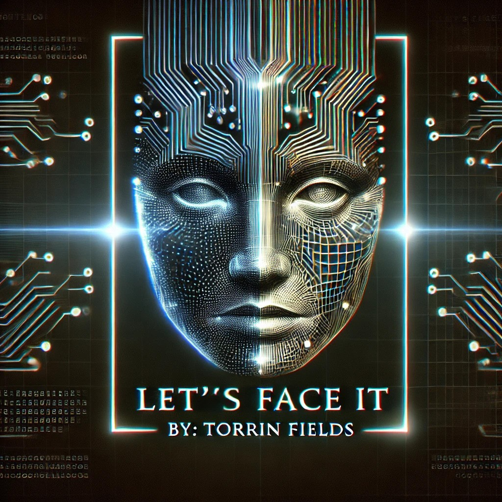
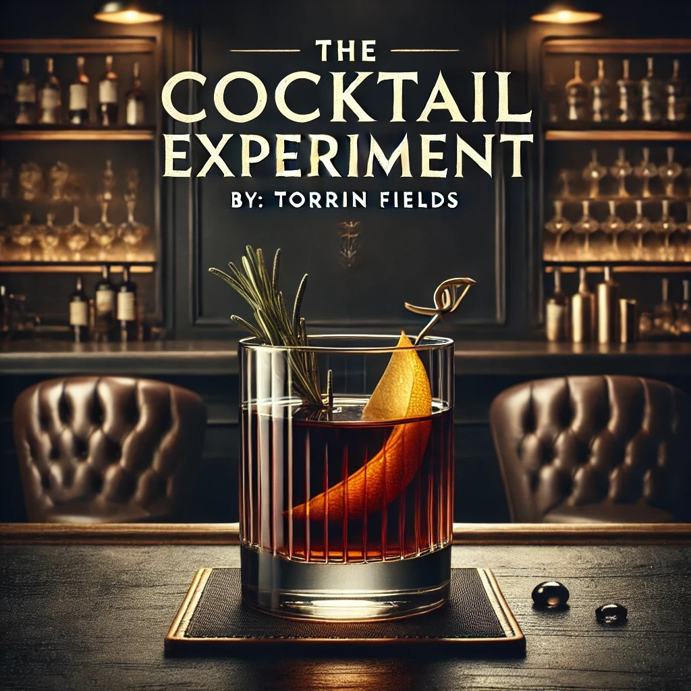
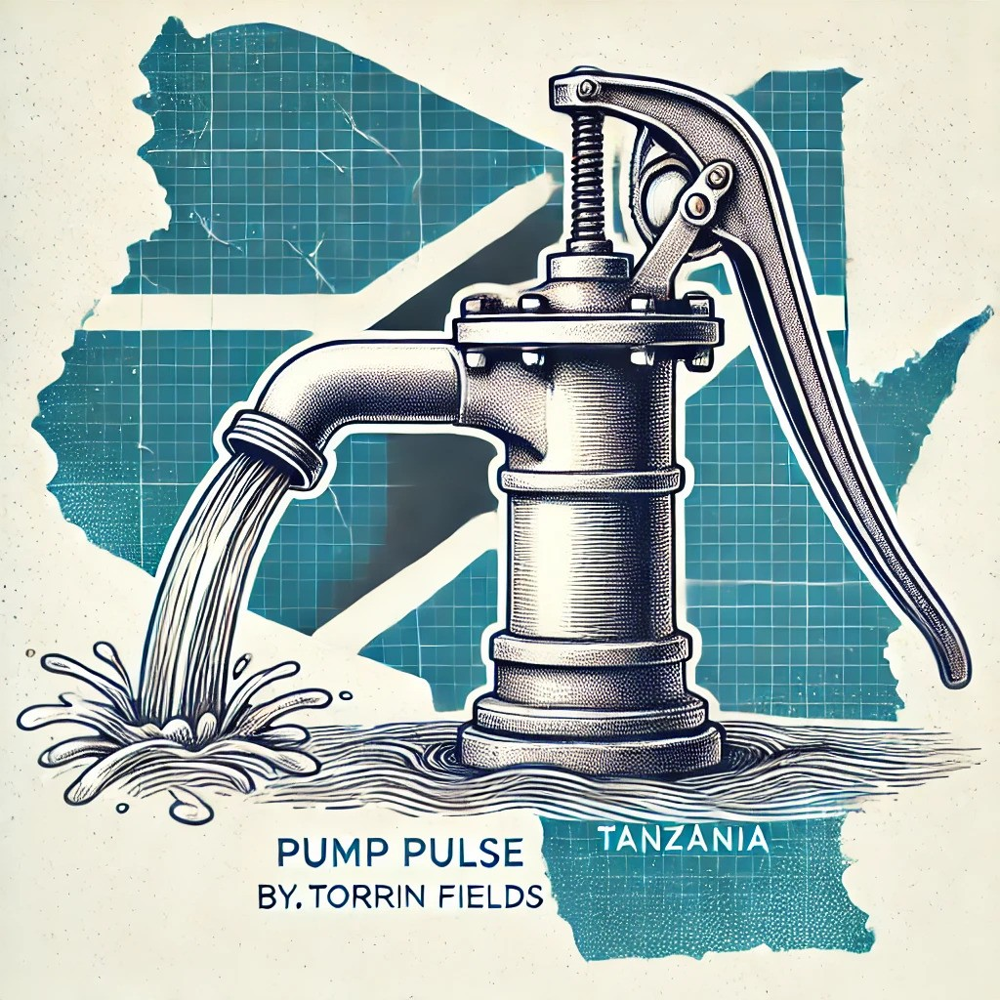
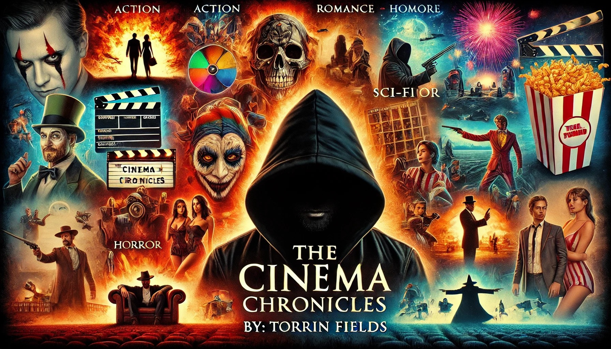

#### Technical Skills: Python, SQL, NumPy, SciPy, Pandas, Matplotlib, Seaborn,Figma, Machine Learning,NLP

## Education
EDUCATION
Flatiron School, New York, NY
Bachelor's Degree in Data Science (Equivalent)
01 2023 – 05/2023

## Work Experience
Flatiron School, New York, NY
Data Science Student
1/2023 – 5/2023
Engaged in intensive data science bootcamp covering statistics, data analysis, and visualization.
Collaborated on various projects involving data cleaning, exploratory data analysis, and predictive modeling.

The Citizen Project, NY
UX Designer
July 2022 – August 2023 (Part-time)
Aided NYC residents interact with government and community leaders to help solve complex problems by designing a robust platform.
Translated user requirements into ideas for storyboards to produce attractive user interfaces.

The Messenger, NY
Data Analyst
At The Messenger, NY, I enhanced data processing efficiency by 20% through data collection, analysis, and interpretation. Using Python and Tableau, I improved report accuracy by 15% and trend identification speed by 25%. Cross-department collaboration reduced project delivery time by 30%.

## Projects

### Data-Driven EDA Lets's Face It

[View EDA](https://github.com/Tfields77/Let-s-Face-It/blob/main/Untitled2_(1)%20(1).ipynb)

During my exploratory data analysis (EDA) on emotion recognition using a YOLOv5 model, I uncovered valuable insights that demonstrate the model's effectiveness in identifying distinct emotions. The model showed strong performance in recognizing emotions such as Surprise, Happy, and Anger, with high accuracy in these categories. While Sad, Contempt, and Disgust presented challenges, their visual similarities often contribute to misclassifications. 

### Data-Driven EDA The Cocktail-Experiment

[View EDA](https://github.com/Tfields77/The-Cocktail-experiment/blob/main/Untitled13%20(2).ipynb)

During my exploratory data analysis (EDA), I identified key patterns and insights from the cocktail dataset. Using heatmaps and word clouds, I visualized the most common flavor profiles and ingredient combinations, which revealed significant preferences for certain flavors like citrus and sweet. Also created and deployed recommendation system.

https://cocktail-experiment.streamlit.app/

### Data-Driven EDA Pump Pulse

[View EDA](https://github.com/Tfields77/Pump-Pulse/blob/main/Untitled7.ipynb)

In this project, I performed an exploratory data analysis on Tanzanian water pump data to predict their functionality. The analysis revealed that gravity-based systems and communal standpipes are the most common water extraction and waterpoint types, respectively, with the Village Water Committee being the primary management entity.

### Data-Driven EDA The Cinema Chronicles

[View EDA](https://github.com/Tfields77/Cinema-Chronicles/blob/main/Ciinema%20Chronicles.ipynb)

The "Cinema Chronicles" document was my Phase 2 project, focusing on data analysis and visualization in cinema. It involved using Python libraries like pandas, matplotlib, and seaborn to clean and analyze movie-related datasets. The project included natural language processing techniques to search for specific actors or directors within the data. Overall, it demonstrated my ability to integrate, transform, and visualize complex datasets effectively.

### Data-Driven EDA The Streaming Wars

[View EDA](https://github.com/Tfields77/Streaming-Wars/blob/main/Streaming_Wars.ipynb)

In my first EDA, I analyzed Netflix, Hulu, Disney+, and Prime Video from 2009 to 2022. I found that Prime Video has the largest movie library and explored each platform's unique strategies for subscription growth. I also discovered that high-quality content doesn't always lead to higher revenue.

### Data-Driven EDA Unveiling The Titanic

[View EDA](https://github.com/Tfields77/Unveiling-The-Titanic/blob/main/Unveiling%20The%20Titanic.ipynb)

Conducted a 24-hour EDA on the Titanic dataset, addressing missing values and uncovering key insights into passenger demographics and survival rates. Used chi-square tests and visualizations to reveal significant relationships between passenger class, cabin information, and survival outcomes, and performed hypothesis testing to analyze age-related survival differences.
